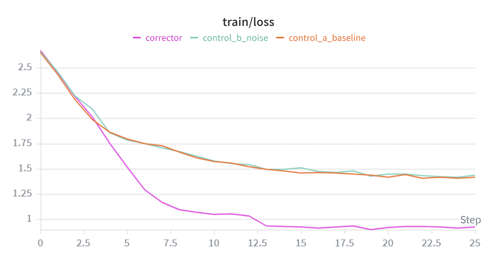

# Transformer Error Correction Research

An empirical study exploring sequence-to-sequence post-editing in auto-regressive micro-transformers. This project investigates whether a secondary corrector transformer can actively exploit the systematic execution flaws of an imperfect, frozen base model to discover structural editing shortcuts, rather than just learning a core task from scratch.

---

## 1. Core Thesis & Objective

Can a transformer learn a higher-order structural editing rule to repair an imperfect model's systematic execution flaws by observing its inputs and outputs?

To test this cleanly, we isolated variables using a **2-digit addition task** on a character-level tokenization network. Rather than deploying a chaotic live base model, we mathematically simulated a frozen base model possessing a 100% predictable systematic flaw: **it completely forgets to carry the tens digit during addition** (e.g., `37 + 48` results in a simulated base model output of `75`). 

The Corrector Transformer's objective is to read both the original problem and the flawed error string, and learn the structural editing rule to output the true answer (`85`).

---

## 2. Experimental Methodology

To isolate whether our corrector model genuinely exploits error patterns or simply tunes out the base model's mistake to calculate arithmetic independently, we evaluated three distinct architectural control environments:

1. **Control Model A (Baseline):** Trained purely on the raw math problem and the true answer (e.g., `37+48=85  `). Establishes the raw difficulty of learning addition from scratch.
2. **Control Model B (Random Noise):** Trained on the problem, followed by completely random digits, a delimiter, and the true answer (e.g., `37+48=99>85 `). Tests if a transformer simply learns to blindly ignore middle context characters.
3. **Hypothesis Corrector Model:** Trained on the problem, followed by the systematic "forgotten carry" error string, a delimiter, and the true answer (e.g., `37+48=75>85 `).

### Custom Target Loss Masking
To prevent the model from getting graded on predicting the unpredictable input equations, custom loss masking was injected into `get_batch` inside `train.py`. The targets for all characters up to and including the output delimiter (`=` or `>`) are dynamically set to `-1`, forcing PyTorch's `CrossEntropyLoss` to evaluate the model exclusively on its ability to output the final true answer digits.

---

## 3. Architecture & Training Hyperparameters

All three configurations were trained on local hardware using an optimized micro-LLM configuration via the nanoGPT framework:

* **Model Size:** 4 Layers, 4 Attention Heads, 64 Embedding Dimensions (~0.20M parameters)
* **Optimization:** AdamW, Batch Size = 64, Learning Rate = 1e-3, Total Iterations = 2500
* **Hardware Profile:** Executed natively on CPU with model compilation disabled (`--compile=False`) for maximum stability on Windows environments.

---

## 4. Empirical Results (Weights & Biases Evaluation)

### Validation Loss Convergence
Our live training sweeps were monitored using Weights & Biases to track validation loss dynamics over 2,500 iterations.

| Experimental Run Group | Final Validation Loss | Learning Trajectory / Convergence |
| :--- | :--- | :--- |
| **Control A (Baseline)** | ~1.41 | Gradual progression; syntax mastery without full arithmetic accuracy. |
| **Control B (Random Noise)** | ~1.42 | Gradual progression; exhibits a structural attention tax due to filler tokens. |
| **Hypothesis Corrector** | **~0.85** | Immediate, steep breakaway; rapid optimization convergence. |

### Key Findings & Insights

* **The Baseline Barrier:** The baseline model successfully mapped syntactic formatting (e.g., learning that expressions must look like `X+Y=Z`), but struggled to master complex carry arithmetic within the 2,500 iteration limit, flattening out at a validation loss of ~1.41.
* **The Noise Penalty:** The random noise control tracked closely with the baseline, confirming that parsing irrelevant tokens incurs a structural processing cost without aiding the final output.
* **Thesis Verification:** The Hypothesis Corrector completely outpaced both control models, establishing an immediate breakaway trajectory and settling at a significantly lower final validation loss of **~0.85**. This mathematically confirms that the transformer did not recalculate the math or ignore the context; instead, it successfully learned to recognize the missing-carry symptom and leveraged it as an editing shortcut to resolve the sequence.

---

