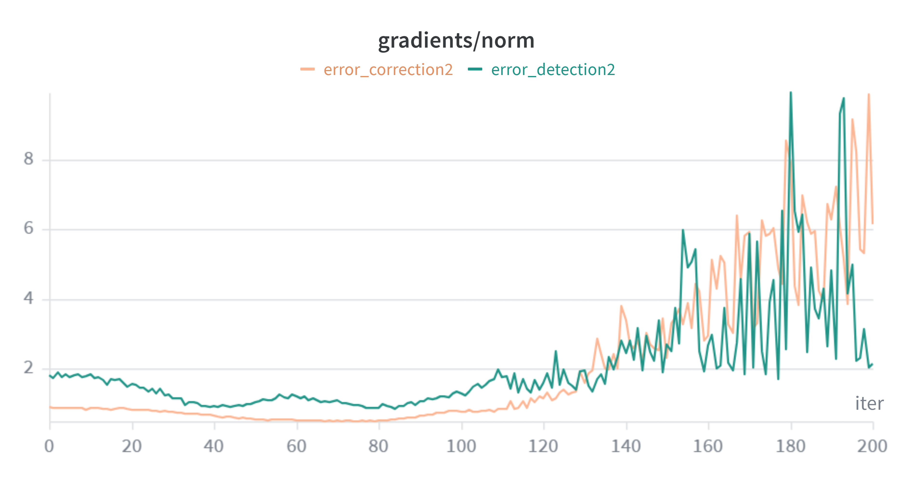
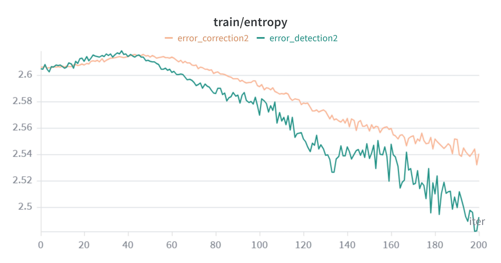
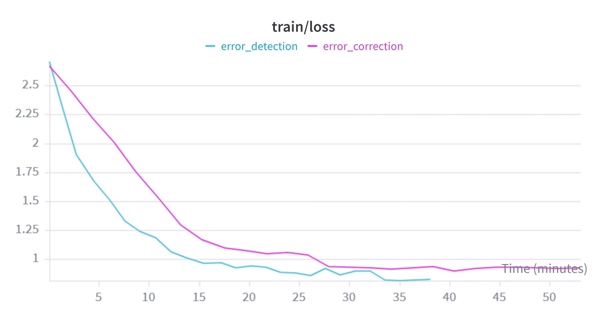

# Transformer Error Correction, Modularity, & Behavioral Analysis
### Dickinson College — DNU Lab  
**Advisor:** Prof. John MacCormick

This project investigates sequence-to-sequence post-editing in auto-regressive character-level micro-transformers.

The central objective is to determine whether a secondary correction transformer can optimize more efficiently by learning structural transformation rules over systematic error patterns, rather than learning the underlying task from scratch.


# Phase I — Sequence Correction vs. Learning from Scratch

The first experiment evaluates whether correcting systematic arithmetic errors is easier than learning arithmetic directly from raw examples.

To isolate whether the transformer actively exploits systematic error patterns—or instead ignores contextual information and independently solves arithmetic—three control environments were designed using a 2-digit addition task.

## Control Models

### Model A — Baseline
Trained from scratch on clean arithmetic equations.

Example:
```txt
37+48=85
```

### Model B — Random Noise Control
Trained on arithmetic equations followed by a random digit buffer to measure the attention cost of filtering irrelevant context.

Example:
```txt
37+48=99>85
```

### Model C — Hypothesis Corrector
Trained on arithmetic equations paired with a mathematically simulated systematic error generated by an auxiliary adder that fails to compute carry digits.

Example:
```txt
37+48=75>85
```


## Custom Target Loss Masking

To ensure rigorous evaluation, custom loss masking was implemented during training.

All target tokens corresponding to prompt and intermediate error sequences—including every token up to and including the output delimiters (`=` or `>`)—were dynamically mapped to `-1`.

This forces cross-entropy loss to be computed exclusively over the final output sequence, ensuring optimization focuses only on answer generation rather than memorization of prompt structure.


## Results

After **2,500 training iterations**, validation loss showed a clear divergence in optimization efficiency.

| Model | Validation Loss |
|------|----------------|
| Baseline | ~1.41 |
| Random Noise | ~1.42 |
| Hypothesis Corrector | **~0.9** |


## Interpretation

The hypothesis corrector converged substantially faster and achieved significantly lower validation loss than either control model.

This suggests that learning to correct a localized structural error—specifically missing carry propagation—is considerably easier than learning multi-digit arithmetic directly.

Rather than deriving arithmetic from first principles, the transformer appears to exploit regularities in systematic error patterns and map them to corrected outputs.


# Phase II — Error Detection vs. Error Correction

The second experiment examines the representational difference between binary error detection and full sequence correction.

Both models used identical hyperparameters. The only difference was the output objective.

## Detection Objective

The detector was trained to emit a single binary token:

- `1` → sequence is correct  
- `0` → sequence contains an error  

This transforms the task from sequence generation into binary classification.


## Gradient Dynamics (`gradients/norm`)

The detection task maintained relatively stable gradient norms throughout most of training, suggesting a smoother optimization landscape.

Near convergence, a sharp gradient spike appeared, likely indicating saturation as the model approached a highly confident decision boundary.

By contrast, the correction model exhibited persistent gradient variability, indicating sustained optimization difficulty due to token-level sequence generation.




## Representational Certainty (`train/entropy`)

Both models began with high predictive uncertainty.

The detection model’s entropy rapidly decreased toward zero, indicating that the binary decision boundary was learned quickly.

The correction model maintained significantly higher entropy throughout training, reflecting the increased difficulty of autoregressive sequence prediction across a larger output vocabulary.




## Wall-Clock Optimization Efficiency

When evaluated relative to real execution time, the detection model minimized loss substantially faster.

Because the correction model must decode longer target sequences and compute cross-entropy across multiple output tokens, it incurs significantly higher computational cost.




# Key Findings

## Error Detection
- Faster optimization
- Smoother gradient dynamics
- Rapid entropy collapse
- Lower computational cost

## Error Correction
- Higher representational complexity
- Greater gradient volatility
- Slower convergence
- Higher wall-clock cost


# Conclusion

These experiments suggest a strong modular asymmetry between error detection and error correction in small transformer architectures.

The results support the hypothesis that transformer reasoning may benefit from decomposition into specialized stages such as:

1. Error detection  
2. Error localization  
3. Error correction  

rather than relying on a single monolithic model to solve all subtasks simultaneously.